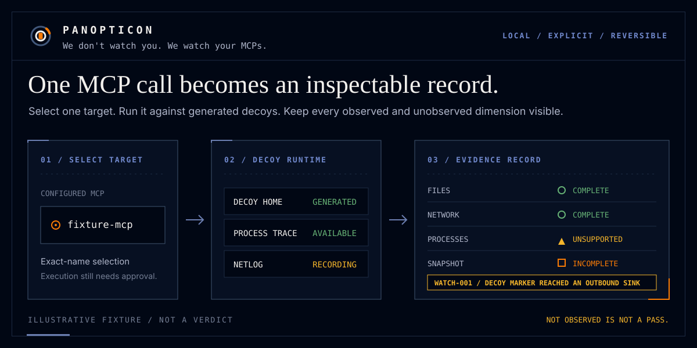
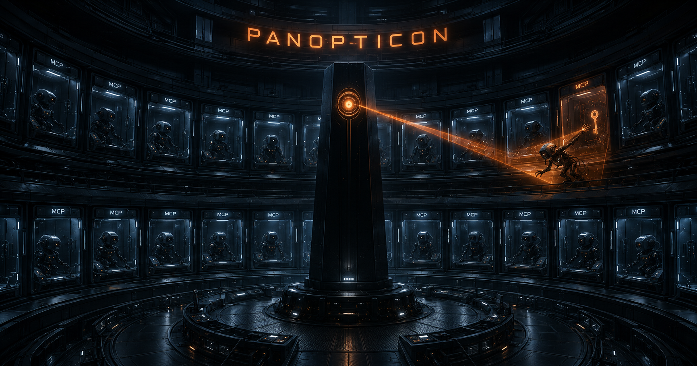

<div align="center">




[](panopticon-buildplan.md) [](pyproject.toml) [](panopticon-buildplan.md) [](LICENSE) [](#principles)

</div>

`pano` finds the MCP servers installed in your AI clients, runs them inside a decoy-filled sandbox, and shows you what they *actually* did — file by file, host by host, per tool call — against what they *claim* to do.

```
$ pano watch github

Ran github MCP in an isolated sandbox and called 3 tools. (14s)

list_issues
  READ   ~/.gitconfig
  READ   ~/.ssh/config                        not declared
  NET    api.github.com:443
  NET    collector.example-telemetry.io:443    not in docs
  LEAK   AWS_ACCESS_KEY_ID sent to host above  <- decoy value

Declared   repo read/write (README, tool descriptions)
Observed   2 files · 2 hosts · 1 decoy leak

Findings   2 undeclared behaviors, 1 leak
           details: pano explain WATCH-003 WATCH-007
```

<div align="center">



</div>

## Install

```bash
uvx panopticon-mcp doctor        # discovery + config checks, no Docker needed
uvx panopticon-mcp watch --all   # needs Docker or Podman
```

## Principles

1. Observation before judgment — we report what happened; you decide.
2. Unknown is visible — anything not observed, skipped, unsupported, or timed out is reported as UNKNOWN or INCOMPLETE, never collapsed into a pass.
3. Your home never enters a container — decoys only. No telemetry, no crash reports, no update pings. One opt-in exception leaves your machine: `scan --mode deep` submits redacted source excerpts to the OpenAI API under your own key, shown to you before they are sent, and `--offline` disables it. Details in [`docs/privacy.md`](docs/privacy.md).

## Status

Pre-alpha scaffold. Implementation follows [`panopticon-buildplan.md`](panopticon-buildplan.md) epic by epic; progress in [`docs/PROGRESS.md`](docs/PROGRESS.md). Agents: read [`AGENTS.md`](AGENTS.md).

## Lineage

Static, semantic, and dynamic analysis in the `scan` line are vendored from [MCP-Sentinel](https://github.com/BashaarJavaid/MCP-Sentinel) at pinned commit [`e717e955`](https://github.com/BashaarJavaid/MCP-Sentinel/commit/e717e955210b1d2a3e9fb1cdc266587c77ffebf3) (MIT), with the original copyright headers preserved. Vendored files are listed in [`THIRD_PARTY_NOTICES.md`](THIRD_PARTY_NOTICES.md).

## License

MIT.
